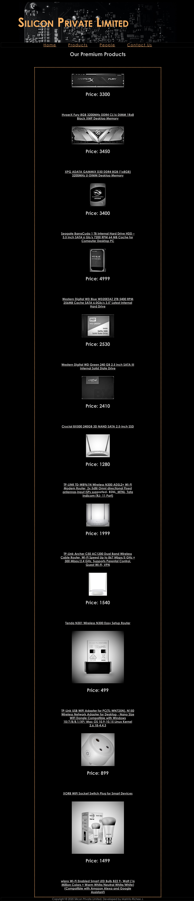
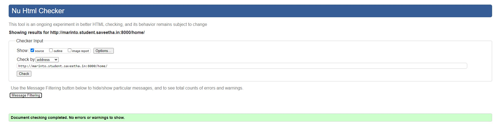
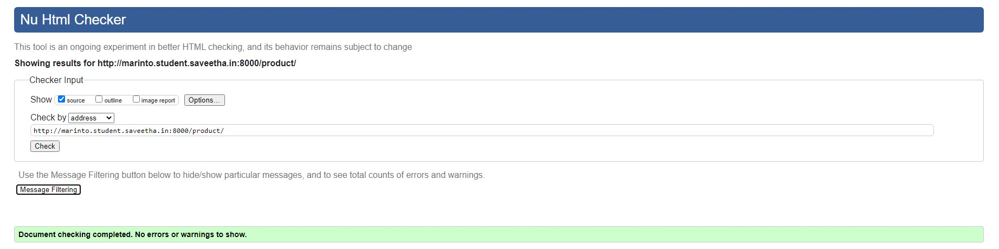
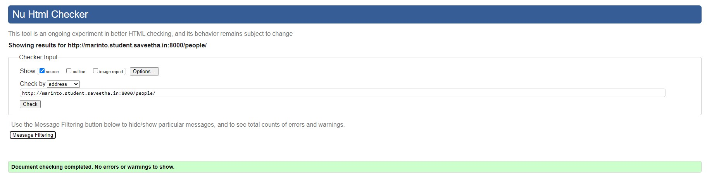
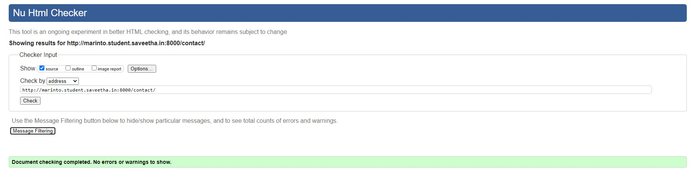
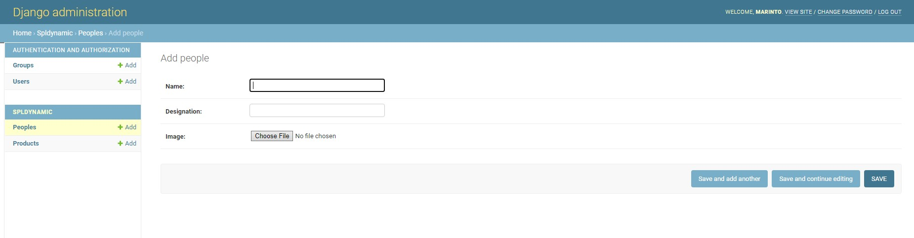
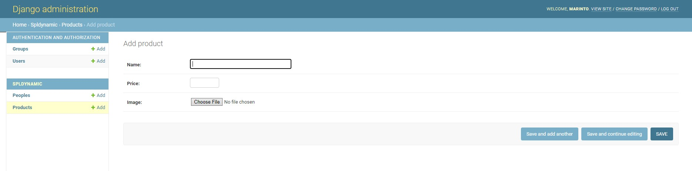
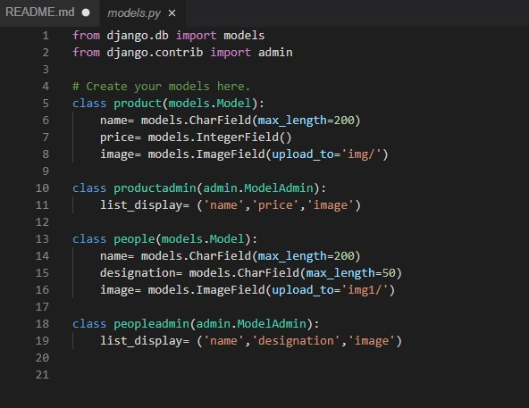

# Dynamic Website Design for a Manufacturing Company
## AIM:
To design a dynamic website for a chip manufacturing company.

## DESIGN STEPS:
### Step 1: 
Requirement collection.
### Step 2:
Creating the layout using HTML and CSS.
### Step 3:
Updating the sample content.
### Step 4:
Choose the appropriate style and color scheme.
### Step 5:
Validate the layout in various browsers.
### Step 6:
Validate the HTML code.
### Step 7:
Create a database model and migrate the database.
### Step 8:
Retrieve data from database and display it in a dynamic webpage.
### Step 9:
Publish the website in the given URL.

## PROGRAM:

### base.html
```

<!DOCTYPE html>
<html lang="en">

<head>
    <title>Silicon Private Limited</title>
    <link rel="stylesheet" href="">
    <link rel="icon" href="" type="image/x-icon">
</head>

<body>

    <div class="parallax">
        <h1 id="title">Silicon Private Limited</h1>
    </div>
    <div class="sticky">
        <nav><a href="http://marinto.student.saveetha.in:8000/home/" style="color: #FAB162"> Home</a>
            <a href="http://marinto.student.saveetha.in:8000/product/" style="color: #FAB162">Products</a>
            <a href="http://marinto.student.saveetha.in:8000/people/" style="color: #FAB162">People</a>
            <a class='space' href="http://marinto.student.saveetha.in:8000/contact/" style="color: #FAB162">Contact
                Us</a>
        </nav>
    </div>
    <div>
        
        
        <footer>Copyright &COPY; 2020 Silicon Private Limited, Developed by Marinto Richee J.</footer>
    </div>
</body>

</html>
```

### home.html
```




<h2>About Us</h2>

<p>Silicon Pvt Ltd, provides a wide range of semiconductor and infrastructure software applications that serve
    the data center, networking, software, broadband, wireless, and storage and industrial markets. Common
    applications for its products include data center networking, home connectivity, broadband access,
    telecommunucations equipment, smartphones, base stations, data center servers and storage, factory
    automation, power generation and alternative energy systems, displays,and mainframe operations and
    management, and application software development. Some of Silicon's core technologies and products include:
</p>
<ul class="margin">
    <li>Memory Chips</li>
    <li>SATA HDD</li>
    <li>SATA SSD</li>
    <li>Broadband Modems</li>
    <li>Wifi Devices</li>
    <li>Switching Devices</li>
    <li>Optical Sensors</li>
</ul>

```
### product.html
```



<div>
    <h1>Our Premium Products</h1>
    <div class="product">
        

        
        <h2 class="designation">Price: {{pro.price}}<br><br><br></h2>
        <h3>{{ pro.name}}</h3>

        
    </div>
</div>


```
### people.html
```




<div>
    
    
    <h2 class="designation">{{ppl.designation}}</h2>
    <h3>{{ ppl.name}}</h3>
</div>




```
### contactus.html
```



<div>
    
    <h1>Contact
    </h1>
    <h3>Email: siliconprivate@yahoo.com</h3>
    <h3>Phone: 999-888-77-66</h3>
    <br>
    <br>
    <br>
</div>


```

## OUTPUT:





## CODE VALIDATION REPORT:





## ADMIN PAGE:


## MODELS.PY:


## GIT: 
https://github.com/Marinto-Richee/companywebsitedynamic.git

## RESULT:
Thus a website is designed for the chip manufacturing company and is hosted in the
URL http://marinto.student.saveetha.in:8000/. HTML code is validated.